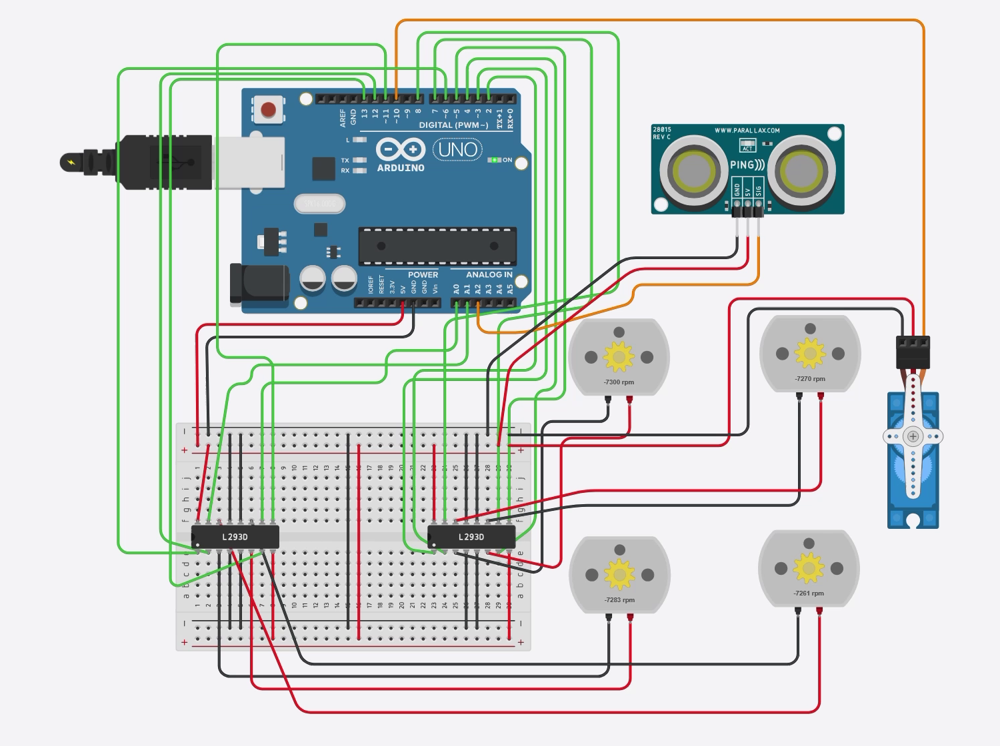
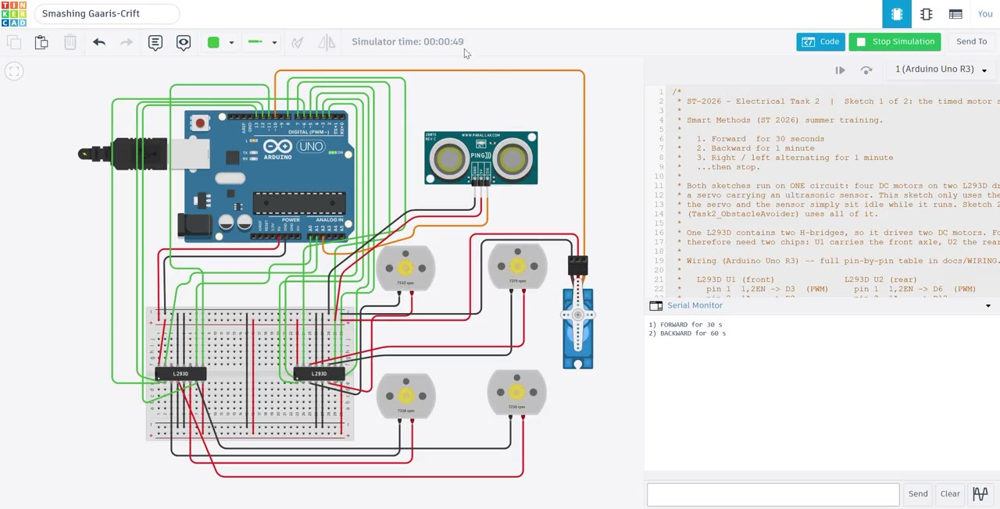

# ST-2026 · Arduino 4WD — L293D Motors & Ultrasonic Obstacle Avoider

Four **DC motors** driven by two **L293D** H-bridge chips on an **Arduino Uno**, plus a
**servo**-mounted **ultrasonic** scanner that stops the robot and changes its direction
when something comes within **10 cm**. Electrical task 2 of the Smart Methods (ST 2026)
summer training.



**One circuit, two sketches.** Everything is wired into a single Tinkercad design;
nothing has to be rewired between the two programs.

| | Sketch 1 | Sketch 2 |
|---|---|---|
| **File** | [`Task1_FourMotorSequence.ino`](Task1_FourMotorSequence/Task1_FourMotorSequence.ino) | [`Task2_ObstacleAvoider.ino`](Task2_ObstacleAvoider/Task2_ObstacleAvoider.ino) |
| **What it does** | The timed sequence: forward 30 s, backward 1 min, right/left alternating 1 min | Drives forward until the sensor sees an obstacle at 10 cm, then stops and changes direction |
| **Uses** | the 4 motors only | the 4 motors + servo + ultrasonic |

Wiring for both: **[`docs/WIRING.md`](docs/WIRING.md)**

---

## ▶️ See it run

[](docs/screenshots/demo.mp4)

**[Play the recording](docs/screenshots/demo.mp4)** — a screen capture of sketch 1 running
in the Tinkercad simulator: all four motors drive forward, flip together at the 30 s
mark, and then tank-turn right and left in 5 s slices.

> GitHub does not play a committed video *inside* a README, so it appears here as the
> clickable thumbnail above. To make it play inline instead, open this README in GitHub's
> web editor and drag `docs/screenshots/demo.mp4` into it — GitHub re-hosts it as an
> inline player.

---

## 1. The task

From the Smart Methods brief:

| # | Requirement | Where it lives |
|---|---|---|
| 1 | Program **4 DC motors** using an **L293D motor driver** | Sketch 1 |
| 1.1 | **Forward** for **30 seconds** | `forward(); delay(FORWARD_MS);` |
| 1.2 | **Backward** for **1 minute** | `backward(); delay(BACKWARD_MS);` |
| 1.3 | **Right and left, alternating**, for **1 minute** | `alternateTurns(ALTERNATE_MS)` |
| 2 | Connect **1 servo motor** with the **L293D shield** and the **ultrasonic** sensor, so that an obstacle at **10 cm** makes the motors **stop and change direction** | Sketch 2 — `avoidObstacle()` |

---

## 2. Three things the brief assumes, and what this build does instead

**"L293D motor driver" for four motors.** One L293D contains **two** H-bridges, so a
single chip drives **two** DC motors. Four motors need **two chips** — U1 for the front
axle, U2 for the rear. That is the only honest way to give all four motors independent
direction and speed.

**"The L293D shield."** The ready-made Adafruit / Deek-Robot L293D *shield* does not
exist in Tinkercad's parts library. What the shield contains is exactly two L293D chips,
so this build wires those chips directly. Same silicon, same result — just visible
instead of hidden under a PCB.

**"Connect a servo to the L293D shield."** A servo **cannot** be driven through an
L293D. It is not a bare DC motor: it has its own H-bridge, potentiometer and control
chip inside, and it expects a PWM *signal* on one wire.

That is not a problem with the brief — it is what the real shield does. The shield's two
**servo headers are hard-wired straight to Arduino pins 10 and 9**, bypassing the L293D
chips entirely. Plugging a servo "into the shield" is electrically identical to plugging
it into a digital pin. This build uses **D10**, the shield's `SERVO_1` pin.

---

## 3. The circuit

Full pin-by-pin tables, chip pinout, and a wiring checklist:
**[`docs/WIRING.md`](docs/WIRING.md)**

The short version:

| Arduino pin | Used for | Arduino pin | Used for |
|---|---|---|---|
| **D2 / D4** | front-left direction | **D3** ~ | front-left enable *(speed)* |
| **D7 / D8** | front-right direction | **D5** ~ | front-right enable |
| **D12 / D13** | rear-left direction | **D6** ~ | rear-left enable |
| **A0 / A1** | rear-right direction | **D11** ~ | rear-right enable |
| **D10** | servo signal | **A2** | ultrasonic `SIG` |

`~` = hardware PWM. `A0`–`A2` are used as plain digital pins here; 12 motor signals plus
a servo plus a sensor is more than D2–D13 can hold.

**Why the enables are 3, 5, 6, 11 and never 9 or 10.** The `Servo` library takes over
Timer1, which disables `analogWrite()` on **pins 9 and 10** while a servo is attached.
Keeping every enable off those two pins means sketch 2 gains a servo and loses no speed
control — and one wiring serves both sketches. Pin 9 stays free as a spare.

> ⚠️ **Real hardware:** power `VCC2` (pin 8) from a separate 6–9 V battery pack rather
> than the Arduino's 5V pin, and tie its ground to the Arduino ground. Four motors
> stalling pull several amps and will brown-out a USB-powered board. In the Tinkercad
> simulator the on-board 5V rail is ideal, so 5 V is fine there.

---

## 4. Sketch 1 — the timed sequence

```
 0 s ─────────────── 30 s ─────────────────────── 90 s ─────────────────────── 150 s
 │    FORWARD         │    BACKWARD                │  RIGHT / LEFT alternating  │ STOP
 │    30 s            │    60 s                    │  60 s (5 s per side)       │
```

Total runtime **2 min 30 s**, then the motors stop and stay stopped. Press **Reset** on
the Arduino (or restart the simulation) to run it again.

**Turning** is a *tank turn*: the left pair spins one way, the right pair the other, so
the robot pivots on the spot instead of arcing. `drive(left, right)` takes one signed
speed per side, which makes every movement a one-liner:

```cpp
void forward()   { drive( DRIVE_SPEED,  DRIVE_SPEED); }
void backward()  { drive(-DRIVE_SPEED, -DRIVE_SPEED); }
void turnRight() { drive( TURN_SPEED,  -TURN_SPEED ); }
void turnLeft()  { drive(-TURN_SPEED,   TURN_SPEED ); }
void stopAll()   { drive(0, 0); }
```

**"Alternating" is timed, not counted.** `alternateTurns()` swaps direction every 5 s and
uses `millis()` to stop at exactly 60 s, trimming the last slice if it would overrun:

```cpp
unsigned long remaining = totalMs - (millis() - startTime);
unsigned long slice     = (remaining < TURN_SLICE_MS) ? remaining : TURN_SLICE_MS;
```

Six turns of 5 s fit the minute exactly, but the trim means you can change
`TURN_SLICE_MS` to 4 s or 7 s and the phase still ends on the minute.

> **On the rpm sign in Tinkercad.** During the forward phase the motors may read
> *negative* rpm and during the backward phase *positive*. That is Tinkercad's own
> convention for which motor terminal sits at the higher voltage — not a direction
> error. What matters is that all four motors carry the **same sign** (they are wired
> consistently) and that they **all flip together** at the 30 s mark. To make forward
> read positive instead, set every entry of `MOTOR_FLIP[]` to `true`.

---

## 5. Sketch 2 — stop at 10 cm and change direction

The robot drives forward and pings ahead every 60 ms. Within 10 cm, it runs
`avoidObstacle()`:

1. **Stop** all four motors — the requirement, taken literally.
2. **Reverse** for 0.6 s to open some space.
3. **Look right** (servo → 30°), **look left** (servo → 150°), measuring at each — then
   return to 90°, facing forward.
4. **Turn toward whichever side has more room**, then carry on driving.

The servo is the sensor's neck: one sensor sees three directions instead of needing
three sensors.

**Reading the 3-pin PING))).** Tinkercad's default ultrasonic part has a single `SIG`
wire that must be an output to fire the chirp and an input to time the echo, so the
sketch flips the pin mid-measurement:

```cpp
pinMode(TRIG_PIN, OUTPUT);       // fire a 5 µs chirp
digitalWrite(TRIG_PIN, HIGH);
delayMicroseconds(5);
digitalWrite(TRIG_PIN, LOW);

pinMode(TRIG_PIN, INPUT);        // now listen for the echo
unsigned long duration = pulseIn(TRIG_PIN, HIGH, ECHO_TIMEOUT_US);
```

Sound covers 1 cm in about 29 µs and the pulse makes the trip **twice**, so
`cm = µs / 58`.

**The silence trap.** `pulseIn()` returns `0` on timeout — meaning *nothing is out
there*, the emptiest reading possible. Compared naively, that `0` looks like an obstacle
touching the sensor, and the robot would brake at thin air. So the sketch returns
`NO_ECHO` (-1) for a timeout and translates it to "very far" only when comparing sides:

```cpp
long clearance(long distanceCm) {
  return (distanceCm == NO_ECHO) ? FAR_AWAY_CM : distanceCm;
}
```

Swap to the 4-pin **HC-SR04** by setting `#define ULTRASONIC_4_PIN 1` and wiring
`TRIG → A2`, `ECHO → A3`.

---

## 6. Explain it like I'm 5 🧒

**Sketch 1 — the little car that follows orders.**

1. **Four wheels, two helpers.** The Arduino is a tiny brain, but it is far too weak to
   push a motor by itself. So it whispers to two helper chips (the L293Ds), and *they*
   do the pushing. Each helper can push two wheels — two helpers, four wheels. ✅
2. **How the brain says "which way".** Every motor has two wires from its helper. Make
   the first one hot and the second one cold → the wheel spins forward. Swap them →
   it spins backward. Make both cold → it stops. That's the whole trick.
3. **How the brain says "how fast".** A third wire, the *enable*, is like a light
   switch flicked on and off super fast. Flick it on nearly all the time → fast wheel.
   Flick it on half the time → half speed.
4. **The orders.** Go straight for 30 seconds. Then backwards for a whole minute. Then
   spin right, spin left, right, left — for another minute. Then freeze.
5. **The stopwatch.** The brain counts with `millis()`, so the turning stops at exactly
   one minute, even mid-spin.

**Sketch 2 — now it can see.**

6. **A bat's trick.** The little sensor shouts a squeak too high for you to hear, then
   listens for the echo. Long wait = the wall is far. Short wait = the wall is close.
7. **A neck.** The sensor is bolted to a servo, so it can turn its head. One eye,
   three directions.
8. **Uh-oh, 10 cm!** The moment the echo says something is 10 cm away, the car
   **stops**. Then it backs up a little, looks right, looks left, decides which side has
   more room, turns that way — and drives off again.

---

## 7. How to run it

1. Open [Tinkercad Circuits](https://www.tinkercad.com/circuits) (or the
   [Arduino IDE](https://www.arduino.cc/en/software) for real hardware).
2. Build the circuit from **[`docs/WIRING.md`](docs/WIRING.md)** — all of it, motors and
   servo and sensor together.
3. Paste in **[`Task1_FourMotorSequence.ino`](Task1_FourMotorSequence/Task1_FourMotorSequence.ino)**
   → **Start Simulation** → 30 s forward, 60 s backward, 60 s of alternating turns, stop.
4. Without changing a single wire, paste in
   **[`Task2_ObstacleAvoider.ino`](Task2_ObstacleAvoider/Task2_ObstacleAvoider.ino)**
   → **Start Simulation** → click the sensor, drag its distance slider below **10 cm**,
   and watch the motors stop, the head sweep right and left, and the robot turn away.
5. Open the **Serial Monitor** (9600 baud) in either sketch — both announce every phase,
   and sketch 2 prints the measured distances.

> ⏱️ Sketch 1 runs for a full 2½ minutes by design, because that is what the brief asks
> for. If you only want a quick check while wiring, temporarily shrink `FORWARD_MS`,
> `BACKWARD_MS`, and `ALTERNATE_MS` at the top of the sketch — but put them back to
> `30000` / `60000` / `60000` before submitting.

---

*Part of my Smart Methods (ST 2026) summer training · Electrical · Task 2*
